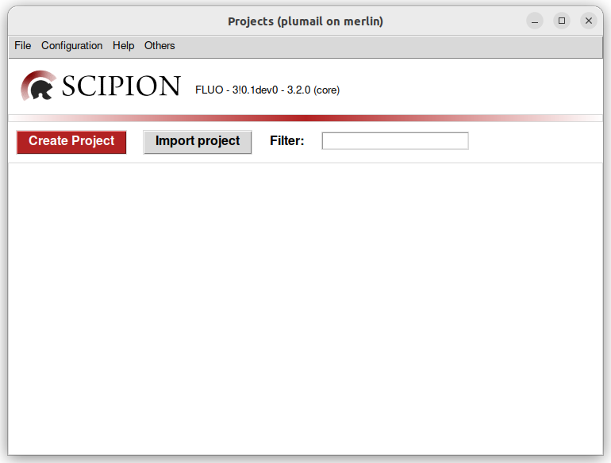

Installation
============

The **spfluo-app** is available on :ref:`Windows <windows-section>` and :ref:`Linux <linux-section>`. A GPU is recommended but not necessary.

.. _windows-section:

On Windows
----------

1. Install Python
    a. Go to the `Python download page <https://www.python.org/downloads/>`_.
    b. Download Python 3.11.
    c. Run the executable.
    d. **Important**: tick the box `Add Python to PATH`.
    e. Click `Install Now`.

2. Install **spfluo-app**
    a. Unzip `spfluo-app.zip`
    b. Open the command line interpreter. To do so:
        i. Press the keys windows + R
        ii. Enter "cmd".
    c. Once the interpreter is opened, enter the following command::

        $ cd C:\path\to\spfluo-app\spfluo-app
    
    The :command:`cd` command will move you to the desired folder.
    
    d. Enter the :command:`dir` command. Make sure the following files are present:
        
        .. code-block:: text

            spfluo-app/
            ├── requirements-cpu.txt
            └── spfluo-app.pyw
    
    e. Run the installation with the following commands:
        - If you have a GPU::

            $ py -m pip install -r requirements-gpu.txt
            $ py -m pip install -r requirements-gpu-windows.txt
        - Otherwise::

            $ py -m pip install -r requirements-cpu.txt

The installation is now complete! You should now be able to double-click on the file ``spfluo-app.pyw``. It should open the Scipion launcher :numref:`[%s] <scipion-launcher>`.

You can create a shortcut:
    1. Right click on the file
    2. More options
    3. Send to the desktop

.. _linux-section:

On Linux
--------

1. Install Python
    Python should already be availble on your distribution. If you have Ubuntu for instance, the command `python` should be available.

2. Install **spfluo-app**
    a. Unzip `spfluo-app.zip`
    b. Open the terminal.
    c. Once the terminal is opened, enter the following command::

        $ cd /path/to/spfluo-app
    
    The :command:`cd` command will move you to the desired folder.
    
    d. Enter the :command:`ls` command. Make sure the following files are present:

        .. code-block:: text

            spfluo-app/
            ├── requirements-cpu.txt
            └── spfluo-app.py

    e. Run the installation with the following commands:
        - If you have a GPU::

            $ python3 -m pip install -r requirements-gpu.txt
        - Otherwise::

            $ python3 -m pip install -r requirements-cpu.txt
            $ python3 -m pip install -r requirements-cpu-linux.txt

The installation is now complete! You should now be able to run ``python3 spfluo-app.py``. It should open the Scipion launcher :numref:`[%s] <scipion-launcher>`.

.. _scipion-launcher:

   The Scipion launcher

Go to :doc:`Tutorial <tutorial>` to get started with using **spfluo-app**.