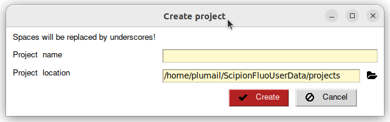
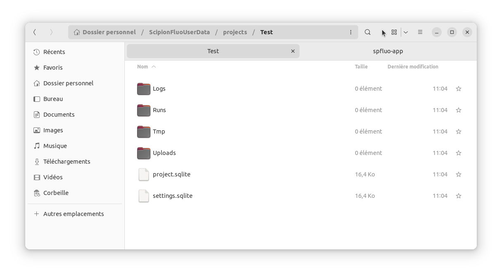
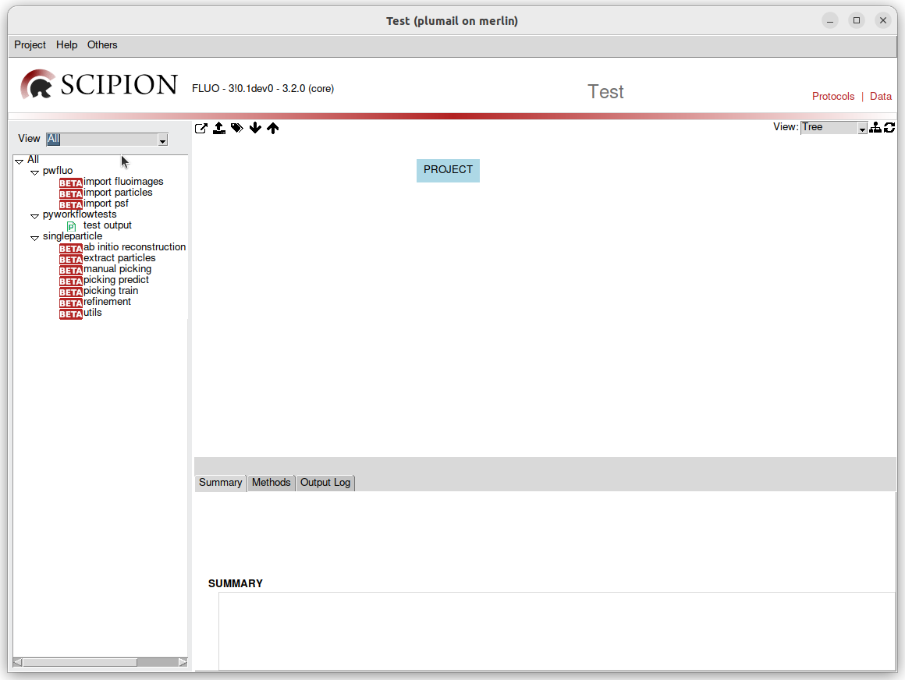
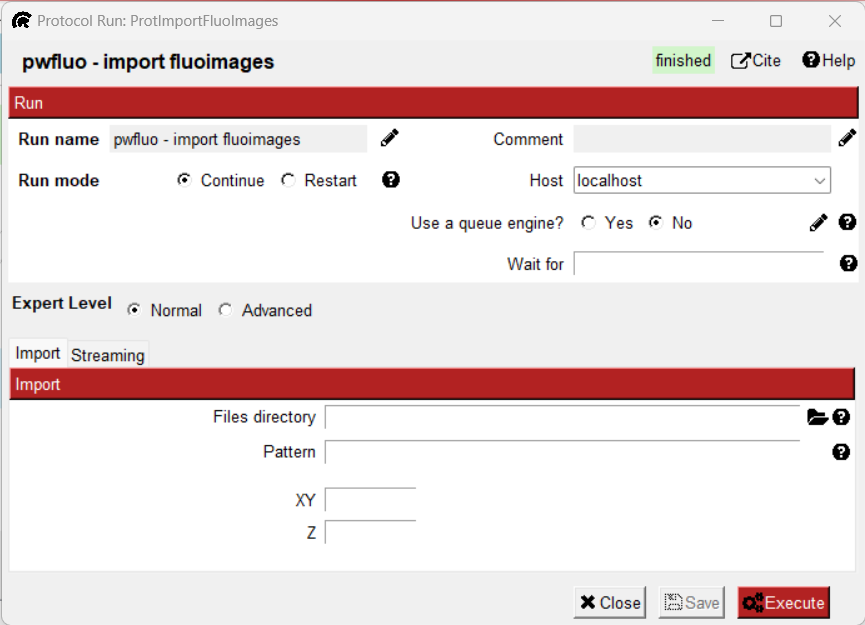
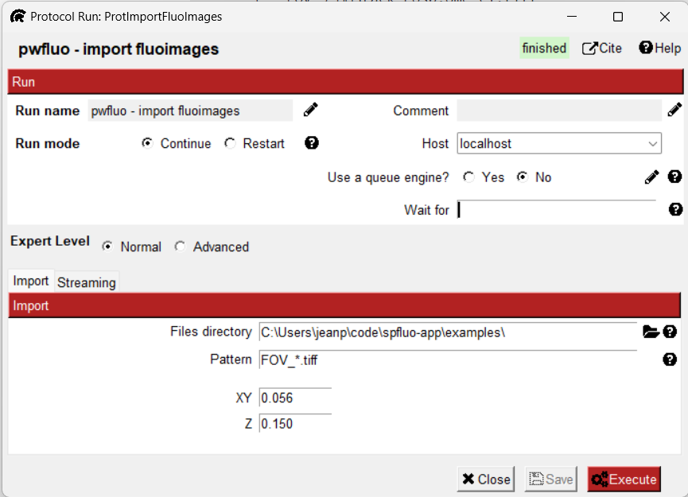
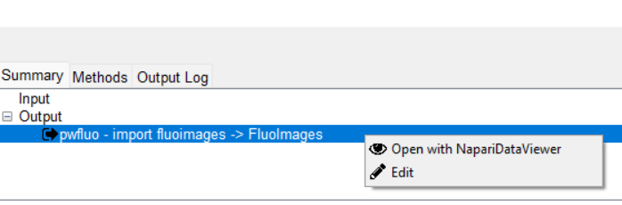

Tutorial
========

**spfluo-app** is a software aiming at bringing single particle reconstruction to fluorescence imaging.

This tutorial will guide you through the app.

What's covered here:
    - Creating a project
    - Importing fluorescence images
    - Visualising data with Napari
    - Picking particles manually
    - Importing a PSF
    - Running reconstruction algorithms like ab initio and refinement

Creating a project
------------------

Launching the app is covered in the :doc:`Installation <installation>` section. Once the app is launched, the Scipion launcher should appear. The **spfluo-app** uses the `Scipion software` as an interface:

.. image:: ../_assets/scipion-launcher-empty.png

Click on create a project.



By default, all your projects will be stored inside the ScipionFluoUserData folder located in your user folder. For example on Windows, it looks like this: ``C:\Users\Pierre\ScipionFluoUserData``.

All the files of the project will be stored inside a folder.



Importing images
----------------

On the left panel click on ``View > All``.



What you see on the left is all the protocols that will populate our workflow. We have:

 * imports protocols, used to imports stuff inside the software.
 * single particle protocols, to apply algorithms to the data.

Double-click on the protocol ``import fluoimages``.



Select the ``examples`` folder that was given with **spfluo-app**. This folder contains the data you will be working with:

.. code-block:: text

    spfluo-app
    └── examples
        ├── FOV_1_MMStack_Pos0.ome_c1.tiff
        ├── FOV_2_MMStack_Pos0.ome_c1.tiff
        ├── FOV_3_MMStack_Pos0.ome_c1.tiff
        └── psf.tiff

The images to import are named ``FOV_X_MMStack_Pos0.ome_c1.tiff``. To match them, we use the pattern ``FOV_*.tiff``. This way, we avoid importing the ``psf.tiff`` file.

The images have a pixel of size 56nm x 56nm x 150nm. We fill the acquisition info in micrometers accordingly.



Then, click on *Execute*.

After some time, the import should be done and the protocol box should turn green. On the bottom of the screen, a panel is summarizing the protocol. In the *Output* section, a ``SetOfFluoImages`` object is displayed. This object represents the images you imported. You can right-click on it to see the available viewers.



.. note::
    
    Almost all the protocols you will output objects in the *Output* section. You can visualise them with any of the available viewers.

Visualise the data you imported with napari.

Visualise data with Napari
--------------------------


Importing a PSF
---------------

To import a PSF, double-click on the protocol ``import psf``. Here, choose the path to the ``psf.tiff`` file`in the examples folder. Fill in the acquisition parameter the same way you did with the images and execute the protocol.

You should be able to visualise the PSF the same way you did previously.

Picking particles manually
--------------------------

To pick particles manually, you will need the ```manual picking`` protocol.

This protocol takes as an input a ``SetOfFluoImages``. Choose the images we imported.

