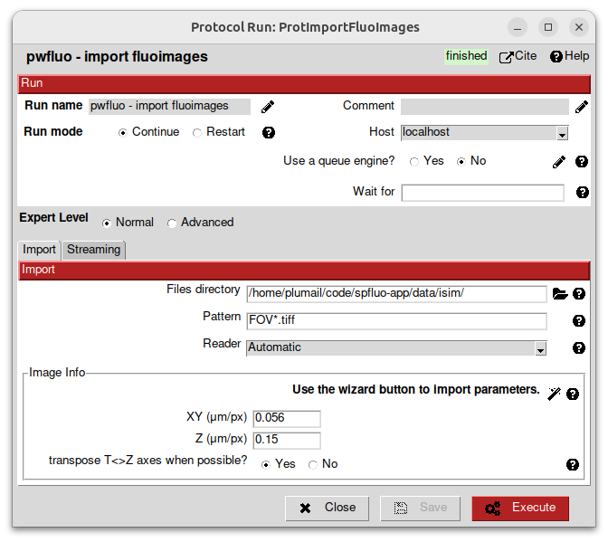

Tutorial
========

**spfluo-app** is a software aiming at bringing single particle reconstruction to fluorescence imaging.

This tutorial will guide you through the app.

What's covered here:
    - Creating a project
    - Importing fluorescence images
    - Visualising data with Napari
    - Picking particles manually
    - Extracting particles
    - Importing a PSF
    - Running reconstruction algorithms like ab initio and refinement

Creating a project
------------------

Launching the app is covered in the :doc:`Installation <installation>` section. Once the app is launched, the Scipion launcher should appear. The **spfluo-app** uses the `Scipion software` as an interface:

.. image:: ../_static/scipion-launcher-empty.png

Click on create a project.

.. image:: ../_static/create-a-project-page.png 

By default, all your projects will be stored inside the ScipionFluoUserData folder located in your user folder. For example on Windows, it looks like this: ``C:\Users\Pierre\ScipionFluoUserData``.

All the files of the project will be stored inside a folder.

Importing images
----------------

On the left panel click on ``View > All``.

.. image:: ../_static/empty-project.png

What you see on the left is all the protocols that will populate our workflow. We have:

 * imports protocols, used to imports stuff inside the software.
 * single particle protocols, to apply algorithms to the data.

Double-click on the protocol ``import fluoimages``.

.. image:: ../_static/import-files.png

Select the ``examples`` folder that was given with **spfluo-app**. This folder contains the data you will be working with:

.. code-block:: text

    spfluo-app
    └── examples
        ├── FOV_1_MMStack_Pos0.ome_c1.tiff
        ├── FOV_2_MMStack_Pos0.ome_c1.tiff
        ├── FOV_3_MMStack_Pos0.ome_c1.tiff
        └── psf.tiff

The images to import are named ``FOV_X_MMStack_Pos0.ome_c1.tiff``. To match them, we use the pattern ``FOV_*.tiff``. This way, we avoid importing the ``psf.tiff`` file.

The images have a pixel of size 56nm x 56nm x 150nm. We fill the acquisition info in micrometers accordingly.

Then, click on *Execute*.

After some time, the import should be done and the protocol box should turn green. On the bottom of the screen, a panel is summarizing the protocol. In the *Output* section, a ``SetOfFluoImages`` object is displayed. This object represents the images you imported. You can right-click on it to see the available viewers.

.. note::
    
    Almost all the protocols you will use output objects in the *Output* section. You can visualise them with any of the available viewers.

Visualise the data you imported with napari.

Visualise data with Napari
--------------------------

Picking particles manually
--------------------------

To pick particles manually, you will need the ``manual picking`` protocol.

This protocol takes as an input a ``SetOfFluoImages``. Choose the images we imported.

Then, click on *Execute*. Another window should pop up.

This ``Fluoimage List`` is the state of your picking. Each line represents an image to do the picking.

Double-click on a line to begin the picking.

Napari will be launched.

.. image:: ../_static/manual-picking-napari-1.png

Here you have a Napari viewer that differs a bit from what we had in the previous section `Visualise data with Napari`_.

There is one ``Picking`` layer in the layer list on the left panel. When selected, this layer allows you to add/delete/modify particles.

If you want to modify the contrast of the image (like we did previously), click on the image layer.

Go back to the ``Picking`` layer to start annotating.

.. |napari-remove| image:: ../_static/napari-remove-points.png
    :height: 2.5ex
    :class: no-scaled-link

.. |napari-select| image:: ../_static/napari-select-points.png
    :height: 2.5ex
    :class: no-scaled-link

.. |napari-move| image:: ../_static/napari-move.png
    :height: 2.5ex
    :class: no-scaled-link

In the *layer controls*, you have 4 buttons:
    - |napari-remove| removes the last selected particle.
    - |napari-add| lets you add a new particle. 
    - |napari-select| lets you select a particle and move it as you want.
    - |napari-move| lets you navigates on the image by click-and-drag.

.. note::
    These buttons can be triggered with ``1``, ``2``, ``3`` and ``4`` keys for a better experience.

Zoom-in with the mouse wheel on a particle.
Select |napari-add| and click on the centriole.
A tiny circle just appeared. It is maybe too tiny, change the ``particle diameter`` with the slider on the left.

On the right panel, you have side views of the particle. Zoom-in to see the centriole better.

You can now adjust the blue circle in all the directions with the |napari-select| mode.

.. important::

    The blue circle should contain the whole particle. Adjust the diameter precisely.

    There shouldn't be any other particles in the blue circle. This can be complicated in some cases. Try to avoid centrioles that are too close to each other!

Now navigate the image to find another particle to pick with the |napari-move| mode.
Once you have found one, you can go back to the |napari-add| mode and continue annotating.

If you made an error, click on the |napari-remove| button or the ``Suppr`` key.

.. video:: ../_static/napari-picking-demo.webm
    :autoplay:
    :loop:
    :muted:
    :width: 700

Once you're done, simply close the window.

The `Fluoimage List` window shows you the number of particles you picked.
You can double-click again on an image to continue to pick or close the window if you're finished.

.. note::
    For the rest of the tutorial, it is recommended to have at least 10 particles picked.

The protocol box is yellow, it means that it's interactive. You will be able in the future to come back to this protocol to add/remove particles.

Extracting particles
--------------------

Now we will extract the particles from the images. For this, we have the ``extract particles`` protocol.
This one is fairly simple: select the coordinates you just generated with the ``manual picking`` protocol and hit *Execute*!

You can visualise the extracted particles the same way you visualised your images at the end of the `Importing images`_ section.

Importing a PSF
---------------

To import a PSF, double-click on the protocol ``import psf``. Here, choose the path to the ``psf.tiff`` file`in the examples folder. Fill in the acquisition parameter the same way you did with the images and execute the protocol.

You should be able to visualise the PSF the same way you did previously.

Running ab initio reconstruction
--------------------------------

