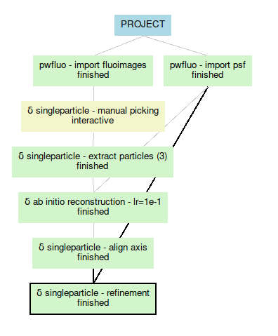

Tutorial
========

**spfluo-app** is a software aiming at bringing single particle reconstruction to fluorescence imaging.

This tutorial will guide you through the app.

What's covered here:
    - Creating a project
    - Importing fluorescence images
    - Visualising data with Napari
    - Picking particles manually
    - Extracting particles
    - Importing a PSF
    - Running reconstruction algorithms like ab initio and refinement

Creating a project
------------------

Launching the app is covered in the :doc:`Installation <installation>` section. Once the app is launched, the Scipion launcher should appear. The **spfluo-app** uses the `Scipion software` as an interface:

.. image:: ../_static/scipion-launcher-empty.png

Click on create a project.

.. image:: ../_static/create-a-project-page.png 

By default, all your projects will be stored inside the ScipionFluoUserData folder located in your user folder. For example on Windows, it looks like this: ``C:\Users\Pierre\ScipionFluoUserData``.

All the files of the project will be stored inside a folder.

.. image:: ../_static/project-folder.png

Importing images
----------------

On the left panel click on ``View > All``.

.. image:: ../_static/empty-project.png

What you see on the left is all the protocols that will populate our workflow. We have:

 * imports protocols, used to imports stuff inside the software.
 * single particle protocols, to apply algorithms to the data.

Double-click on the protocol ``import fluoimages``.

.. image:: ../_static/import-files.png

Select the ``examples`` folder that was given with **spfluo-app**. This folder contains the data you will be working with:

.. code-block:: text

    spfluo-app
    └── examples
        ├── FOV_1_MMStack_Pos0.ome_c1.tiff
        ├── FOV_2_MMStack_Pos0.ome_c1.tiff
        ├── FOV_3_MMStack_Pos0.ome_c1.tiff
        └── psf.tiff

The images to import are named ``FOV_X_MMStack_Pos0.ome_c1.tiff``. To match them, we use the pattern ``FOV_*.tiff``. This way, we avoid importing the ``psf.tiff`` file.

The images have a pixel of size 56nm x 56nm x 150nm. We fill the acquisition info in micrometers accordingly.

.. image:: ../_static/import-files-filled.png

Then, click on *Execute*.

After some time, the import should be done and the protocol box should turn green. On the bottom of the screen, a panel is summarizing the protocol. In the *Output* section, a ``SetOfFluoImages`` object is displayed. This object represents the images you imported. You can right-click on it to see the available viewers.

.. image:: ../_static/output-right-click-napariviewer.png

.. note::
    
    Almost all the protocols you will use output objects in the *Output* section. You can visualise them with any of the available viewers.

Visualise the data you imported with napari.

Visualise data with Napari
--------------------------

Picking particles manually
--------------------------

To pick particles manually, you will need the ``manual picking`` protocol.

This protocol takes as an input a ``SetOfFluoImages``. Choose the images we imported.

.. image:: ../_static/manual-picking-protocol.png

Then, click on *Execute*. Another window should pop up.

.. image:: ../_static/manual-picking-fluoimage-list.png

This ``Fluoimage List`` is the state of your picking. Each line represents an image.

Double-click on a line to begin the picking. Napari will be launched.

.. image:: ../_static/manual-picking-napari-1.png

Here you have a Napari viewer that differs a bit from the one we had in the previous section `Visualise data with Napari`_.

There is one ``Picking`` layer in the layer list on the left panel. When selected, this layer allows you to add, delete or modify particles.
If you want to modify the contrast of the image (like we did previously), click on the image layer.

Click on the ``Picking`` layer to start annotating.

.. |napari-add| image:: ../_static/napari-add-points.png
    :height: 2.5ex
    :class: no-scaled-link

.. |napari-select| image:: ../_static/napari-select-points.png
    :height: 2.5ex
    :class: no-scaled-link

.. |napari-move| image:: ../_static/napari-move.png
    :height: 2.5ex
    :class: no-scaled-link

In the *layer controls*, you have 4 buttons:
    - |napari-remove| removes the last selected particle.
    - |napari-add| lets you add a new particle. 
    - |napari-select| lets you select a particle and move it as you want.
    - |napari-move| lets you navigates on the image by click-and-drag.

.. note::
    These buttons can be triggered with ``1``, ``2``, ``3`` and ``4`` keys for a better experience.

Zoom-in with the mouse wheel on a particle.
Select |napari-add| and click on the centriole.
A tiny circle just appeared. It may be too tiny, change the ``particle diameter`` with the slider on the left.

On the right panel, you have side views of the particle. Zoom-in to see the centriole better.

You can now adjust the blue circle in all the directions with the |napari-select| mode.

.. important::

    The blue circle should contain the whole particle. Adjust the diameter precisely.

    There shouldn't be any other particles in the blue circle. This can be complicated in some cases. Try to avoid centrioles that are too close to each other!

Now navigate the image to find another particle to pick with the |napari-move| mode.
Once you have found one, you can go back to the |napari-add| mode and continue annotating.

If you made an error, click on the |napari-remove| button or the ``Suppr`` key.

.. video:: ../_static/napari-picking-demo.webm
    :autoplay:
    :loop:
    :muted:
    :width: 700

Once you're done, simply close the window.

.. image:: ../_static/manual-picking-fluoimage-list2.png

The `Fluoimage List` window shows you the number of particles you picked.
You can double-click again on an image to continue to pick or close the window if you're finished.

.. note::
    For the rest of the tutorial, it is recommended to have at least 10 particles picked.

The protocol box is yellow, it means that it's interactive. You will be able in the future to come back to this protocol to add or remove particles.

Extracting particles
--------------------

Now we will extract the particles from the images. For this, we have the ``extract particles`` protocol.
This one is fairly simple: select the coordinates you just generated with the ``manual picking`` protocol and hit *Execute*!

You can visualise the extracted particles the same way you visualised your images at the end of the `Importing images`_ section.

Importing a PSF
---------------

To import a PSF, double-click on the protocol ``import psf``. Here, choose the path to the ``psf.tiff`` file`in the examples folder. Fill in the acquisition parameter the same way you did with the images and execute the protocol.

You should be able to visualise the PSF the same way you did previously.

Running the ab initio reconstruction
------------------------------------

Select the ``ab initio reconstruction``. This protocol is easy to use. Simply select the extracted particles and the PSF you just imported.

.. |scipion-help| image:: ../_static/scipion-help.png
    :height: 2.5ex
    :class: no-scaled-link

In this protocol you can change the *Expert Level* to *Advanced*. It allows you to modify more parameters, especially in the Reconstruction params tab.
Click on |scipion-help| to get explanations.

.. image:: ../_static/ab-initio-advanced.png

This protocol will take some time to finish. To see if the run is doing well, go to the ``Output Log`` tab on the bottom panel.
Here you have ``run.stdout`` which prints all the commands that were called during the run;
and, more importantly, ``run.stderr`` which gives you the progression of the algorithm.

.. image:: ../_static/ab-initio-outputlog.png

On line 52 here, you can see:

.. code-block:: text

    00052:   energy : 24078884957.1:   5%|▌         | 1/20 [00:18<05:59, 18.92s/it]

which reads: 1 epoch over 20 was done in 18s. The approximate ending of the algorithm is in 5m59s.

When the protocol is finished, you will have 2 outputs:
 - a reconstructed volume that you can visualise
 - a set of particles with approximated rotations.
   Here the visualisation is the same as the raw extracted particles, but internally each particle stores a rotation found during the ab initio reconstruction.
   They will be used in the ``refinement`` protocol.

Running the refinement
----------------------

The refinement will take as input the particles from the ab initio reconstruction output.

As the ab initio protocol, it will give you a reconstructed volume that you can visualise.

You're done! Here is how your workflow should look like.

Conducting experiments
----------------------

When experimenting with the algorithms, you may want to change parameters or add particles to your picking.

This is possible with Scipion! There are 2 ways :
 - If you don't care about the previous results, you can restart a protocol with new parameters / inputs with the ``Run mode`` set to Restart.

   .. image:: ../_static/scipion-runmode.png
   
   This will overwrite your previous run and the data will be lost.

 - If you want to keep the previous results, create another protocol. You can have as many protocols as you want in your project.
   
   .. image:: ../_static/scipion-twoexp.png

   Renaming your protocols depending on the experiment you're doing might be a good idea. In the protocol windows, simply change the ``Run name``.

.. note::
    The ``manual picking`` protocol is *interactive* which means you can add particles without going into the restart mode.
    A new set of particles is saved each time you enter the manual picking.