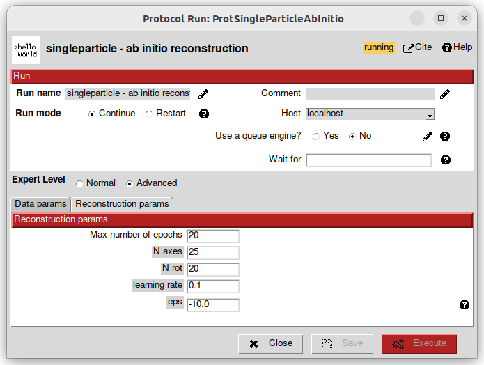

Running the ab initio reconstruction
------------------------------------

Select the ``ab initio reconstruction``. This protocol is easy to use. Simply select the extracted particles and the PSF you just imported.

In this protocol you can change the *Expert Level* to *Advanced*. It allows you to modify more parameters, especially in the Reconstruction params tab.
Click on |scipion-help| to get explanations.

This protocol will take some time to finish. To see if the run is doing well, go to the ``Output Log`` tab on the bottom panel.
Here you have ``run.stdout`` which prints all the commands that were called during the run;
and, more importantly, ``run.stderr`` which gives you the progression of the algorithm.

.. image:: ../../_static/ab-initio-outputlog.png

On line 52 here, you can see:

.. code-block:: text

    00052:   energy : 24078884957.1:   5%|▌         | 1/20 [00:18<05:59, 18.92s/it]

which reads: 1 epoch over 20 was done in 18s. The approximate ending of the algorithm is in 5m59s.

When the protocol is finished, you will have 2 outputs:
 - a reconstructed volume that you can visualise
 - a set of particles with approximated rotations.
   Here the visualisation is the same as the raw extracted particles, but internally each particle stores a rotation found during the ab initio reconstruction.
   They will be used in the ``refinement`` protocol.

The reconstructed volume might not be aligned with the vertical axis.
To impose a cylindrical symmetry constraint during the refinement, we first need to align the volume with the `align axis` protocol!