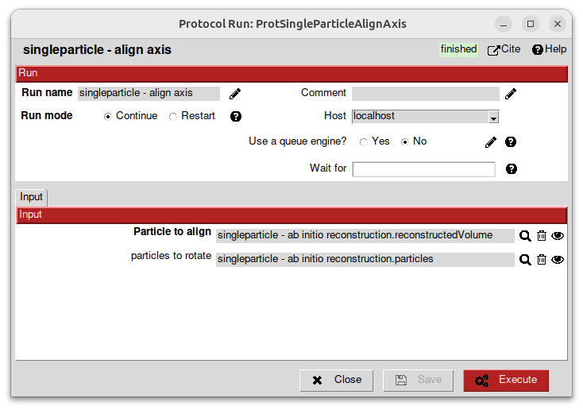

Alignment
---------

Select on the left the `align axis` protocol.

This one will take:
    - a cylindrical particle that needs to be aligned
    - and (optionnaly) associated particles to rotate accordingly

Select the outputs of the previous ab initio reconstruction protocol.

Once the protocol is executed, vizualize the aligned_volume output. You should the cylindre of the centriole from the top.