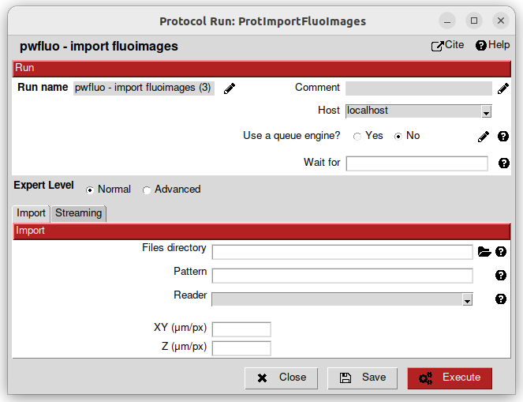
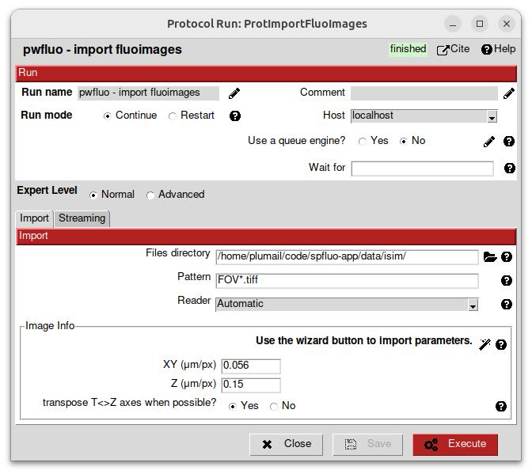
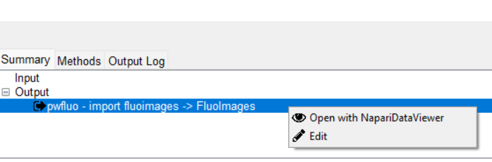

Importing images
----------------

On the left panel click on ``View > All``.

.. image:: ../../_static/empty-project.png

What you see on the left is all the protocols that will populate our workflow. We have:

 * imports protocols, used to imports stuff inside the software.
 * single particle protocols, to apply algorithms to the data.

Double-click on the protocol ``import fluoimages``. It should open a window.

In the *Files directory* field, select the ``uEXM`` folder that was given with **spfluo-app**. This folder contains the data you will be working with:

.. code-block:: text

    spfluo-app
    └── examples
        └── uEXM
            ├── FOV_1_MMStack_Pos0.ome.tiff
            ├── FOV_2_MMStack_Pos0.ome.tiff
            ├── FOV_3_MMStack_Pos0.ome.tiff
            ├── ...
            └── psf.tiff

The images to import are named ``FOV_XX_MMStack_Pos0.ome.tiff``. To match them, we fill the *pattern* field with ``FOV_*.tiff``. This way, we avoid importing the ``psf.tiff`` file.

Choose the ``OmeTiffReader`` for the reader, since our images are OME-TIFF files.

.. note::

    While OME-TIFF format is well supported by **spfluo-app**, other TIFF formats might not be well read: for instance, the Z dimension may miss.

The images have a pixel of size 56nm x 56nm x 150nm. We fill the acquisition info in micrometers accordingly.

Then, click on *Execute*.

After some time, the import should be done and the protocol box should turn green. On the bottom of the screen, a panel is summarizing the protocol. In the *Output* section, a ``SetOfFluoImages`` object is displayed. This object represents the images you imported. You can right-click on it to see the available viewers.

.. note::
    
    Almost all the protocols you will use output objects in the *Output* section. You can visualise them with any of the available viewers.

Visualise the data you imported with napari in the next section.