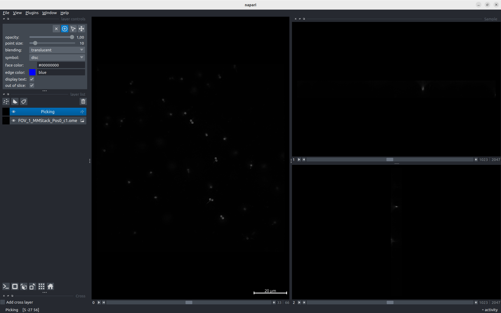

Picking particles manually
--------------------------

To pick particles manually, you will need the ``manual picking`` protocol.

This protocol takes as an input a ``SetOfFluoImages``. Choose the images we imported.

.. image:: ../../_static/manual-picking-protocol.png

Then, click on *Execute*. Another window should pop up.

.. image:: ../../_static/manual-picking-fluoimage-list.png

This ``Fluoimage List`` is the state of your picking. Each line represents an image.

Double-click on a line to begin the picking. Napari will be launched.

Here you have a Napari viewer that differs a bit from the one we had in the previous section :doc:`visualise-napari`.

There is one ``Picking`` layer in the layer list on the left panel. When selected, this layer allows you to add, delete or modify particles.
If you want to modify the contrast of the image (like we did previously), click on the image layer.

Click on the ``Picking`` layer to start annotating.

.. |napari-remove| image:: ../../_static/napari-remove-points.png
    :height: 2.5ex
    :class: no-scaled-link

.. |napari-add| image:: ../../_static/napari-add-points.png
    :height: 2.5ex
    :class: no-scaled-link

In the *layer controls*, you have 4 buttons:
    - |napari-remove| removes the last selected particle.
    - |napari-add| lets you add a new particle. 
    - |napari-select| lets you select a particle and move it as you want.
    - |napari-move| lets you navigates on the image by click-and-drag.

.. note::
    These buttons can be triggered with ``1``, ``2``, ``3`` and ``4`` keys for a better experience.

Zoom-in with the mouse wheel on a particle.
Select |napari-add| and click on the centriole.
A tiny circle just appeared. It may be too tiny, change the ``particle diameter`` with the slider on the left.

On the right panel, you have side views of the particle. Zoom-in to see the centriole better.

You can now adjust the blue circle in all the directions with the |napari-select| mode.

.. important::

    The blue circle should contain the whole particle. Adjust the diameter precisely.

    There shouldn't be any other particles in the blue circle. This can be complicated in some cases. Try to avoid centrioles that are too close to each other!

Now navigate the image to find another particle to pick with the |napari-move| mode.
Once you have found one, you can go back to the |napari-add| mode and continue annotating.

If you made an error, click on the |napari-remove| button or the ``Suppr`` key.

.. video:: ../../_static/napari-picking-demo.webm
    :autoplay:
    :loop:
    :muted:
    :width: 700

Once you're done, simply close the window.

.. image:: ../../_static/manual-picking-fluoimage-list2.png

The `Fluoimage List` window shows you the number of particles you picked.
You can double-click again on an image to continue to pick or close the window if you're finished.

.. note::
    For the rest of the tutorial, it is recommended to have at least 10 particles picked.

The protocol box is yellow, it means that it's interactive. You will be able in the future to come back to this protocol to add or remove particles.
