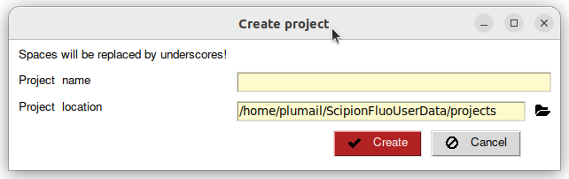

Creating a project
------------------

Launching the app is covered in the :doc:`../installation` section. Once the app is launched, the Scipion launcher should appear. The **spfluo-app** uses the `Scipion software` as an interface:

.. image:: ../../_static/scipion-launcher-empty.png

Click on create a project.

By default, all your projects will be stored inside the ScipionFluoUserData folder located in your user folder. For example on Windows, it looks like this: ``C:\Users\Pierre\ScipionFluoUserData``.

All the files of the project will be stored inside a folder.

.. image:: ../../_static/project-folder.png