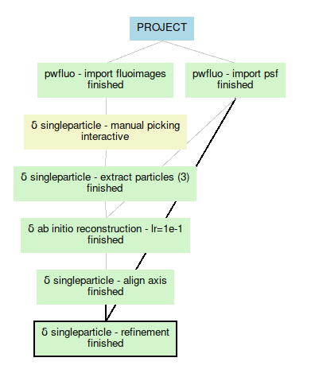

Running the refinement
----------------------

The refinement will take as input the particles from the ab initio reconstruction output.

As the ab initio protocol, it will give you a reconstructed volume that you can visualise.

You're done! Here is how your workflow should look like.

