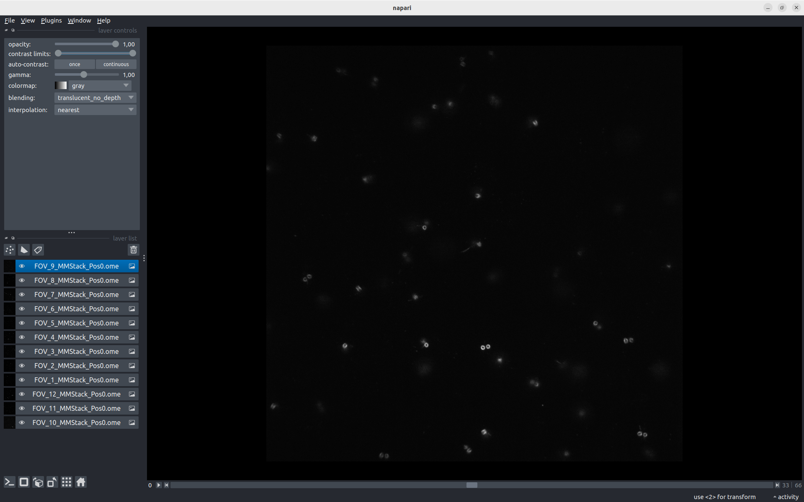

Visualise data with Napari
--------------------------

.. _napari: https://www.napari.org/

When you open your ``SetOfFluoImages``, it launches napari_, a visualisation tool.

In the layer list on the left, you have all the images you just imported.

To visualise only one layer, you need to make the other invisible. Click on one layer, then select all of them with ``Ctrl+A``, and make them invisible with ``Right-click > Toggle visibility``.
Now you can visualise one layer at a time by toggling its visibility with |napari-eye|.

Adjust the constrast of the image with the ``contrast limits`` slider.

.. warning::
    Be carefull, the contrast is adjusted only for the layer selected!

    If you want to apply the same contrast to all the images, you need to link the layers: ``Ctrl+A``, ``Right-click > Link Layers``.

.. seealso::
    
    More in-depth explanations are available in the napari docs on the page `using the image layer <https://napari.org/stable/howtos/layers/image.html>`_.